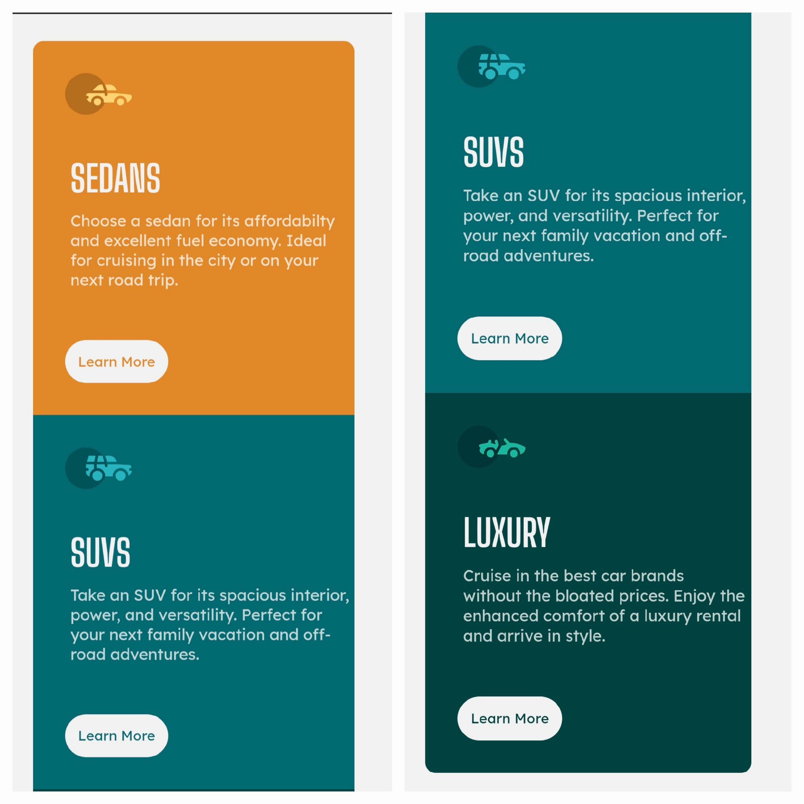
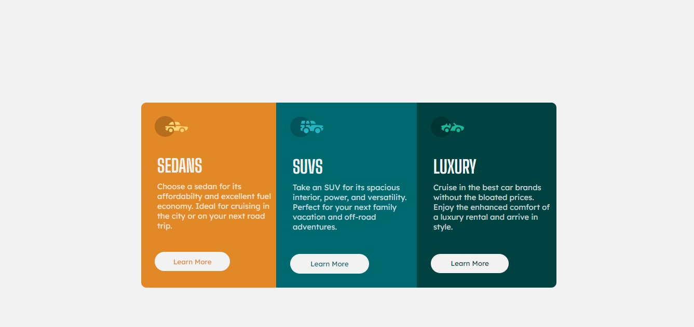

# 3-column-preview-card

This is a solution to the [3-column preview card component challenge on Frontend Mentor](https://www.frontendmentor.io/challenges/3column-preview-card-component-pH92eAR2-). Frontend Mentor challenges help you improve your coding skills by building realistic projects. 

## Table of contents

- [Overview](#overview)
  - [Screenshot](#screenshot)
  - [Links](#links)
- [My process](#my-process)
  - [Built with](#built-with)
- [Author](#author)

## Overview

### Screenshot
Mobile

Desktop

### Links

- Solution URL: (https://github.com/d0nda/3-column-preview-card/)
- Live Site URL: (https://d0nda.github.io/3-column-preview-card/)

## My process

### Built with

- Semantic HTML5 markup
- CSS  properties

## Author

- Frontend Mentor - [@d0nda](https://www.frontendmentor.io/profile/d0nda)

